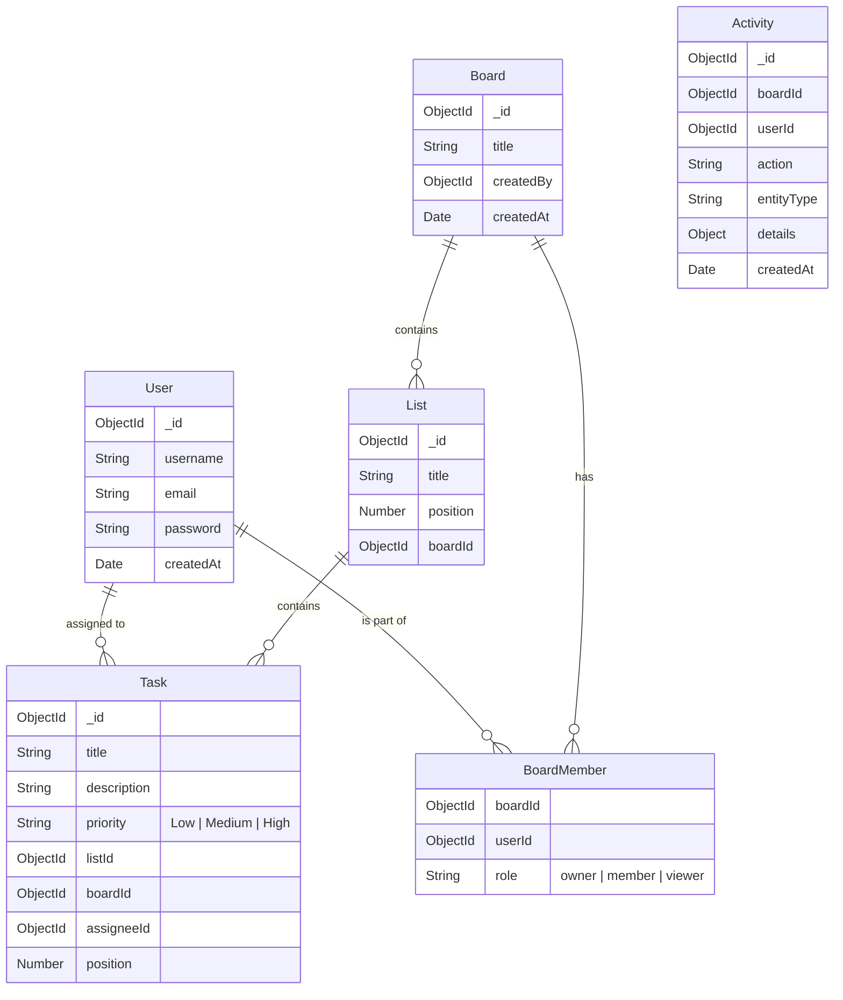

# 🏗 System Architecture

## High-Level Overview

CollabBoard follows a standard **Client-Server Architecture** with a persistent bidirectional connection for real-time capabilities.

```mermaid
graph TD
    Client[Client (React + Vite)]
    LB[Load Balancer / Nginx]
    API[Backend API (Node/Express)]
    Socket[Socket.io Service]
    DB[(MongoDB)]
    
    Client -- HTTP/REST --> LB
    Client -- WebSocket --> LB
    LB --> API
    LB --> Socket
    API --> DB
    Socket --> DB
    API -- Events --> Socket
```

## 🔌 Real-Time Synchronization Strategy

We use **Socket.io** to enable real-time collaboration. The system is designed around **Event Consistency**.

1.  **Connection**: Client connects to `wss://api.collabboard.com` and authenticates via JWT handshake.
2.  **Room Subscription**: When a user visits a board, they emit `join_board` event, adding their socket ID to a room named `board:{id}`.
3.  **Broadcasting**:
    *   **Action**: User A moves a task.
    *   **Optimistic UI**: User A's UI updates immediately.
    *   **Server Event**: API processes the move and emits `task_moved` to `board:{id}`.
    *   **Client Reconciliation**: User B receives `task_moved` and updates their local state.

## 💾 Database Schema Design

The database is normalized to `3NF` where appropriate, but uses **Embedding** for board members to reduce join overhead on frequent reads.



## 🛡 Security & Scalability

### Security Layers
1.  **Transport**: All data in transit strictly over HTTPS/WSS.
2.  **Authentication**: Stateless JWT (JSON Web Tokens) with 30-day expiry.
3.  **Authorization**:
    *   Role-Based Access Control (RBAC) via `BoardMember` collection.
    *   Midddleware `canEditBoard` checks user permissions before mutation.
4.  **Injection Prevention**: Mongoose sanitization prevents NoSQL injection.

### Scalability Measures
*   **Horizontal Scaling**: Stateless REST API allows adding `n` server instances behind a load balancer. (Requires Redis Adapter for Socket.io in multi-node).
*   **Database Indexing**:
    *   `db.tasks.createIndex({ boardId: 1, listId: 1 })` -> Optimizes board loading.
    *   `db.tasks.createIndex({ title: "text", description: "text" })` -> Optimizes search.
*   **Pagination**: Tasks (`limit=50`) and Activities are paginated to prevent large payloads.
